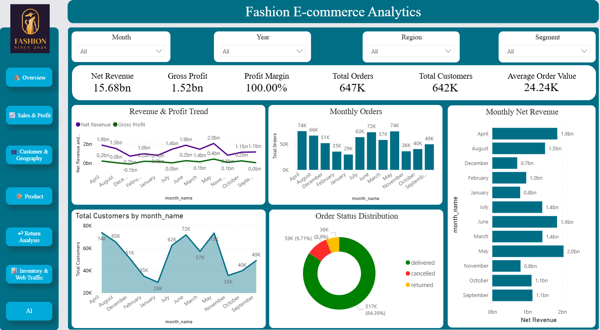
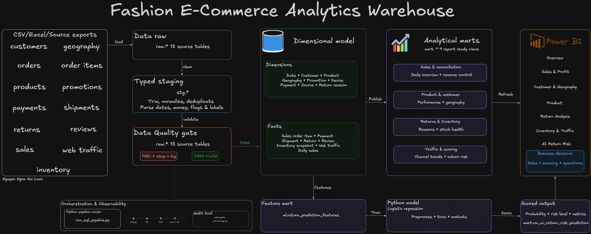
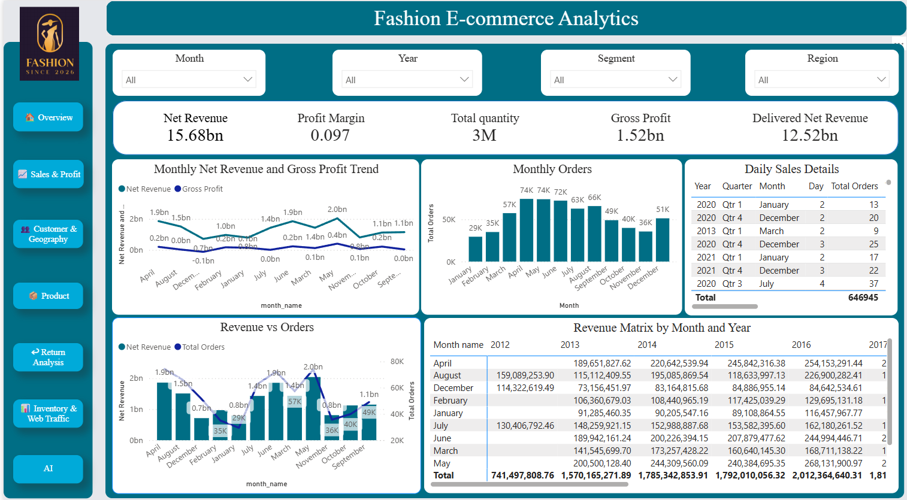
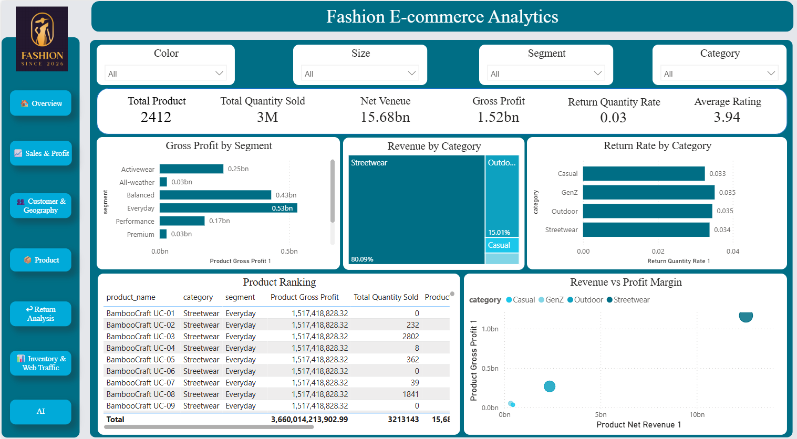
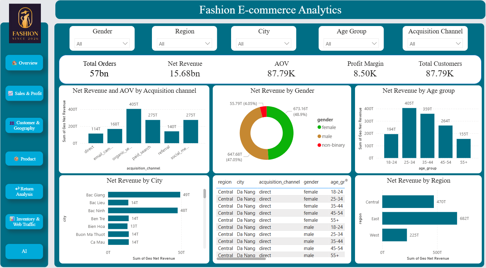
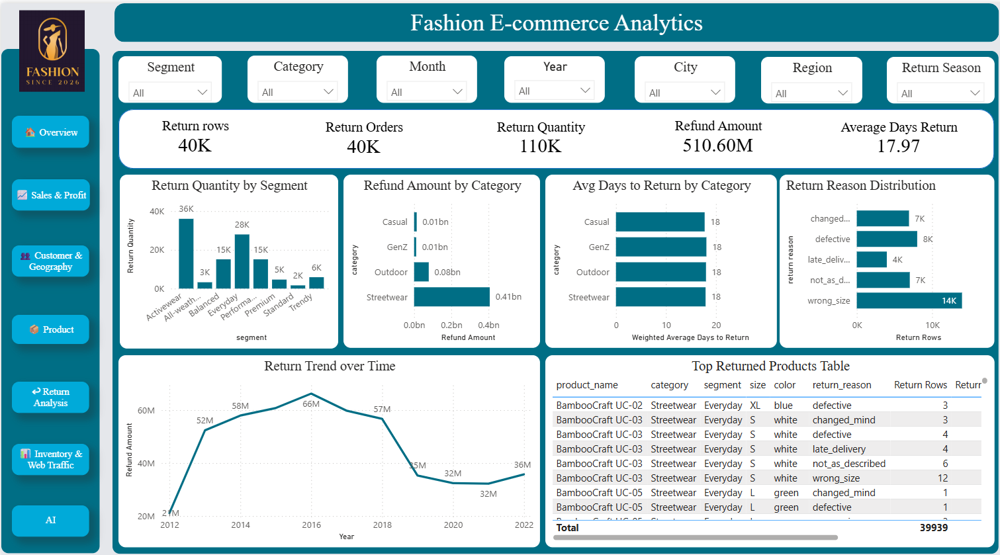
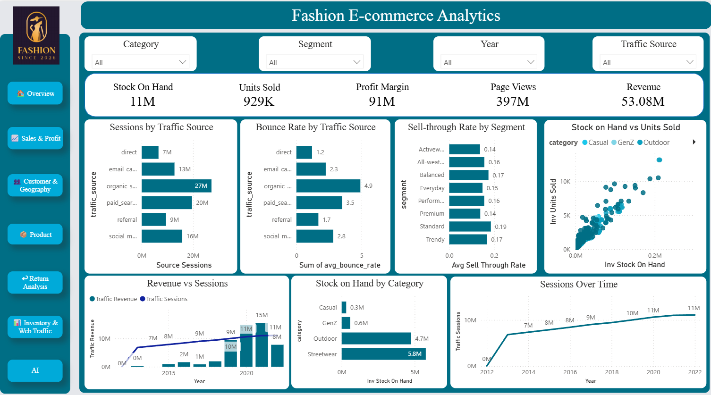
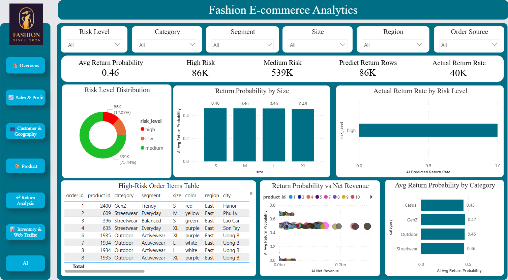

# Fashion E-Commerce Analytics Warehouse

An end-to-end analytics portfolio project that consolidates fragmented
e-commerce data into a layered SQL Server warehouse, business-facing marts, an
interactive Power BI report, and an experimental return-risk model.

The project covers sales, customers, products, promotions, payments, returns,
reviews, inventory, shipments, geography, and web traffic.



## Business objective

The warehouse was designed to give business teams one consistent analytical
layer for answering questions such as:

- How are revenue, gross profit, margin, orders, and average order value
  changing?
- Which products, categories, and customer segments drive performance?
- Where are customers located and which acquisition channels perform best?
- What products and reasons contribute most to returns and refunds?
- Which products are at risk of stockout, overstock, or low sell-through?
- How does web traffic relate to revenue?
- Can an interpretable baseline model flag order items with elevated return
  risk?

## Validated data snapshot

These figures were independently recomputed from the data embedded in the PBIX
semantic model.

| Metric | Value |
| --- | ---: |
| Order-item rows | 714,669 |
| Orders | 646,945 |
| Distinct customers | 90,246 |
| Products | 2,412 |
| Quantity sold | 3,213,143 |
| Net revenue | 15.68B |
| Gross profit | 1.52B |
| Profit margin | 9.68% |
| Return records | 39,939 |
| Returned quantity rate | 3.41% |
| Web sessions | 91.45M |
| Analysis period | 2012–2022 |

The monetary values use the dataset's native currency units. See
[metric definitions and validation](docs/metrics-validation.md) for the exact
formulas and full-precision results, and see the
[data dictionary](docs/data-dictionary.md) for table grains and field groups.

## Architecture



[Open the high-resolution PNG](docs/architecture.png)

The data starts from CSV, Excel, or operational extracts across 13 business
domains. It then follows the governed path below:

1. Load source values into `raw.*` tables as `NVARCHAR` to preserve
   traceability.
2. Clean, standardize, deduplicate, and safely cast the data into typed
   `stg.*` tables.
3. Run 32 data-quality checks covering nulls, keys, referential integrity, and
   business rules. Critical failures stop the refresh and are logged.
4. Resolve surrogate keys and load conformed dimensions and analytical facts
   under `dwh.*`.
5. Publish nine report-ready `mart.*` views at explicit business grains.
6. Refresh seven bookmark-driven Power BI views for business analysis.
7. In parallel, build governed return-risk features, score a logistic
   regression baseline in Python, and publish the results back through the AI
   mart.

See the [detailed architecture and data flow](docs/data-flow.md) for source
domains, layer inputs and outputs, orchestration, and failure behavior.

| Layer | Purpose |
| --- | --- |
| `raw` | Preserves source values as text for traceability and safe conversion |
| `stg` | Standardizes types, dates, money, flags, and business labels |
| `dq` | Logs null, uniqueness, referential-integrity, and business-rule checks |
| `dwh` | Organizes conformed dimensions and analytical facts |
| `mart` | Publishes report-ready views at explicit business grains |
| `ml` | Stores return-risk features, evaluation results, and predictions |
| `audit` | Tracks pipeline and step status, duration, and errors |

## Analytical marts

Power BI imports nine report-facing SQL views:

1. `mart.vw_sales_overview_daily`
2. `mart.vw_revenue_reconciliation`
3. `mart.vw_return_analysis`
4. `mart.vw_product_performance`
5. `mart.vw_inventory_health`
6. `mart.vw_customer_geography`
7. `mart.vw_traffic_sales_daily`
8. `mart.vw_web_traffic_by_source`
9. `mart.vw_ai_return_risk_prediction`

The semantic model uses these marts for seven bookmark-driven report views:

| View | Focus |
| --- | --- |
| Overview | Executive sales, profit, order, and customer KPIs |
| Sales & Profit | Monthly trends, order status, and revenue matrix |
| Product | Product/category performance, ratings, and return rate |
| Customer & Geography | Regions, cities, demographics, and acquisition channels |
| Return Analysis | Return reasons, refund value, products, and time trends |
| Inventory & Web Traffic | Stock, sell-through, sessions, bounce rate, and traffic revenue |
| AI | Baseline return probability and risk segmentation |

<details>
<summary>Dashboard gallery</summary>

### Sales and profit



### Product performance



### Customer and geography



### Return analysis



### Inventory and web traffic



### Return-risk baseline



</details>

## Data quality

The stored procedure `dq.usp_run_basic_data_quality_checks` defines 32 checks:

| Check type | Count | Examples |
| --- | ---: | --- |
| Not null | 8 | Required order, customer, product, and return identifiers |
| Uniqueness | 3 | Customer, product, and order business keys |
| Referential integrity | 9 | Orders, products, geography, payments, returns, and reviews |
| Business rules | 12 | Positive quantity, valid discounts, dates, ratings, and refund values |

Twenty-six checks are classified as critical and six as warnings. The pipeline
raises an error when any critical check fails.

## Return-risk baseline

The Python workflow:

1. Reads 30 numerical and categorical features from SQL Server.
2. Applies median/mode imputation, scaling, and one-hot encoding.
3. Trains a class-weighted logistic regression model.
4. Evaluates classification and ranking metrics across multiple thresholds.
5. Writes predictions, risk levels, metrics, and feature coefficients back to
   SQL Server.

The current embedded snapshot reaches ROC AUC `0.621`, precision `0.111`, and
recall `0.239` at threshold `0.60`. It is intentionally presented as a baseline
experiment rather than a production model.

## Repository structure

```text
fashion-ecommerce-dwh/
├── data/raw/                 # Local source extracts (not committed)
├── docs/
│   ├── architecture.svg      # GitHub-ready vector architecture diagram
│   ├── architecture.png      # High-resolution shareable export
│   ├── data-flow.md          # Sources, transformations, controls, and outputs
│   ├── data-dictionary.md
│   └── metrics-validation.md
├── ml/models/                # Generated model artifacts
├── powerbi/
│   ├── FashionDW.pbix
│   ├── images/
│   ├── README.md             # PBIX placement and Git LFS notes
│   └── measures.dax          # Correct reusable DAX measures
├── scripts/
│   └── run_sql_pipeline.py
├── sql/
│   ├── audit/
│   ├── dimensions/
│   ├── dq/
│   ├── facts/
│   ├── marts/
│   ├── ml/
│   ├── raw/
│   └── staging/
├── .env.example
└── requirements.txt
```

For the split Windows download, extract the code archive and then copy the
separately downloaded `FashionDW.pbix` file into the `powerbi/` directory.

## Local setup

### Prerequisites

- SQL Server 2019 or later
- Microsoft ODBC Driver 17 or 18 for SQL Server
- Python 3.11+
- Power BI Desktop
- Git LFS for versioning the PBIX file

### Python environment

```bash
python -m venv .venv
```

Activate the environment, then install the dependencies:

```bash
pip install -r requirements.txt
```

Copy `.env.example` to `.env` and set the local SQL Server connection.
Credentials are never committed.

### SQL execution order

The intended bootstrap order is:

1. Create database and schemas.
2. Create and load raw tables.
3. Create and load staging tables.
4. Create data-quality and audit objects.
5. Create and load dimensions.
6. Create and load core and advanced facts.
7. Create analytical marts.
8. Build ML feature/evaluation tables.
9. Train and score the return-risk baseline.
10. Refresh Power BI.

For refreshes after bootstrap:

```bash
python scripts/run_sql_pipeline.py
```

The runner performs a preflight check and refuses to execute when a required SQL
file is missing or empty.

## Source snapshot status

The supplied source snapshot contains the working PBIX artifact, schema DDL,
data-quality implementation, orchestration code, and ML code. It also contains
empty placeholder files for several staging loads, fact definitions/loads,
mart definitions, audit definitions, and ML feature tables. Consequently, the
repository is not yet a one-command rebuild from an empty SQL Server instance.

Before presenting this as a reproducible engineering project, export the
implemented database objects from SQL Server into those placeholder files and
rerun the complete bootstrap.

## Power BI modeling notes

- Create calculations in `powerbi/measures.dax` with **New measure**, not
  **New column**.
- Use one conformed date dimension and sort `month_name` by `month`.
- Prefer one-to-many, single-direction relationships from dimensions to facts.
- Use additive numerators and denominators to calculate ratios at query time.
- Use the latest selected inventory snapshot instead of summing stock across
  time.

## Security and version control

- `.env`, local data extracts, virtual environments, backups, and trained model
  binaries are excluded.
- The PBIX file is configured for Git LFS to avoid bloating Git history.
- No credentials are included in the repository package.
